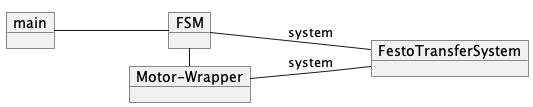

# PRP2 Praktikumsaufgabe 2: Steuerung des Festo-Transfersystems mittels Finite State Machine

### Lernziele

Sie können ...

- ... einen Wrapper/Adaptor für eine Schnittstelle implementieren.
- ... eine Steuerung als State Machine (FSM) modellieren.
- ... eine FSM systematische als Klasse in C++ implementieren.
- ... die Implementierung debuggen und in Betrieb nehmen.

## Allgemeine Hinweise

### Vorbereitung und Durchführung:

- Bitte bereiten Sie die nachfolgenden Aufgaben so weit wie technisch
  möglich vorm Praktikumstermin vor.
- Um den größten Lerneffekt zu erzielen, wird empfohlen, dass zunächst
  jeder von Ihnen versucht, die Aufgaben selbständig zu lösen. (Tauschen
  Sie sich bei Problemen in Ihrer Gruppe oder mit anderen Kommilitonen
  aus.)
- Die Lösungen sind am Anfang des Praktikums zu präsentieren und ggf.
  bis zum Ende des Praktikums zu vervollständigen.
- **Die Lösungen sind *nach erfolgreicher* Abnahme auf den Git-Server
  hochzuladen (push).**

### Bitte beachten:

- **Verändern Sie nicht den mitgelieferten Source Code.** (Außer an
  Stellen, an denen dies explizit erlaubt ist. (siehe README))
- Verwenden Sie ausschließlich die in der Aufgabenstellung angegebenen
  Bezeichner und Namen (z.B. für Funktionen, Variablen usw.).
- Achten Sie auf Ihren *Coding Style*.
- Achten Sie auf ausreichende und sinnvolle Kommentare in Ihrem Code.

### Erfolgreiche Teilnahme / Abnahme:

- Es besteht Anwesenheitspflicht bei allen Praktikumsterminen.
- Zu jedem Programm **muss** ein Design (d.h. z.B. UML Klassendiagramm
  oder Zustandsmaschine) angefertigt werden. Diese sind zuerst
  vorzuzeigen! **Ohne Design wird der Code nicht abgenommen!**
- Die erfolgreiche Abnahme *aller* Aufgaben **bis zum Ende des
  jeweiligen Praktikumstermins.**
- Die Abnahme erfolgt **individuell** und nicht pauschal für jedes Team.
- Der Code **muss** sinnvollen, einheitlichen Codingstyles entsprechen.
  ("C-Coding Style" in Teams)
- Abnahme im Termin:
  - Vorführung der vollständigen Lösungen
  - Befragung zu der Bearbeitung, den Lösungen sowie verwandten
    theoretischen Themen
- Abgabe der Lösung erfolgt durch push auf den git-Server. Im push
  enthalten sein müssen:
  - Design-Dokumente (Idee, Algorithmen, Struktur der Lösung)
  - Source-Code
  - Commit-Message des letzten Commits muss "final-PraktikumX" sein
    (X=Praktikumsnummer (1-4)).
  - Optional: Testergebnisse/Screenshots etc.

## 1 Das Festo Transfersystem

Für das Festo-Transfersystem soll in diesem Praktikum eine
Ablaufsteuerung implementiert werden. Der Ablauf soll als
Zustandsautomat modelliert und dann systematisch in einer Klasse in C++
umgesetzt werden. Benutzen Sie für den Zugriff auf die Sensoren/die
Ansteuerung des Festo-Transfersystems **die neue API, die Sie vom
Git-Server holen können. (\`\`\`git update\`\`\`\`\`\`)**

### 1.1 Änderungen an der API

Die Schnittstellen für den Zugriff auf die Lichtschranken, Tasten, LEDs
und die Ampel haben sich geändert. (Siehe Sourcecode der Klassen
`AlarmLamp`,`FeedSeparator`, `LighBarrier`, `LED`, `PushButton`.)

Zusätzlich sind nun Sensoren zur Höhenmessung (Klasse `HeightSensor`)
und zur Metalldetektierung (Klasse `MetalDetector`) hinzugekommen:

#### Tabelle1: Neue Objete in der Klasse `FestoTransferSystem`

| Objekt        | Methode              | Rückgabe `true`                                                  | Rückgabe `false`                                                        |
|---------------|----------------------|------------------------------------------------------------------|-------------------------------------------------------------------------|
| `heightcheck` | `isHeightCorrect()`  | Höhe ist OK (Hohes Werkstück oder Werkstück mit Loch nach unten) | Höhe ist nicht OK (Flaches Werkstück oder Werkstück mit Loch nach oben) |
| `metalcheck`  | `isMetalDetected()`  |  Metall erkannt                                                  | Kein Metall erkannt                                                     |

## 2 Beschreibung des Verhaltens der Anlage

Prinzipiell soll die Steuerung folgendes Verhalten haben:

- Es sollen die metallischen Werkstücke aussortiert werden.
- Um Metall zu erkennen, muss dieses oben liegen. Werkstücke mit Metall
  haben alle ein Loch auf der Seite mit Metall. Ist das Ergebnis der
  Höhenmessung OK, kann es sein, dass das Loch und somit auch das Metall
  nach unten liegen. Ein manuelles Drehen des Werkstücks ist daher in
  diesen Fällen notwendig.
- Das Ergebnis der Höhenmessung soll in der Ampel signalisiert werden,
  bis das Werkstück den nächsten Zustand erreicht hat. Das Ergebnis
  (Höhe in Ordnung = Q1 leuchtet) ist weiterhin erkennbar.
- Die Start-Taste schaltet die Anlage zwischen Standby und
  Betriebsbereit um. Wird ein Werkstück transportiert, kann die Anlage
  nicht nach Standby geschaltet werden. Ist ein Schalten über den
  Start-Taster möglich, so leuchtet die LED dieses Tasters.
- Die LED Q2 zeigt an, ob die Weiche geöffnet ist.
- Wird ein Werkstück transportiert, dann leuchtet die gelbe Lampe.
  Ausnahme: nach der Höhenmessung und nach dem Metalldetektor.

### 2.1 Allgemeine Beschreibung

Ein Objekt der Klasse `FestoTransferSystem` stellt Objekte und Methoden
für die Kommunikation mit den Sensoren und Aktuatoren des
Festo-Transfersystems bereit. Folgende Methoden gelten für das
Gesamtsystem:

- `updateSensors()`: Liest den aktuellen Zustand der Sensorwerte über
  das USB-Interface aus und stellt die Werte intern zu weiteren
  Auswertung den entsprechenden Sensorobjekten zur Verfügung.
- `updateActuators()`: Die Methode überträgt die von den entsprechenden
  Aktuatorobjekten eingeplanten Ansteuerungen über das USB-Interface zu
  den Aktuatoren.

Die Methoden sollte nur aufgerufen werden, wenn dieses erforderlich ist,
da der Datenaustausch ca. 100-200 ms in Anspruch nimmt.

### 2.2 Detaillierte Beschreibung

1.  Zu Beginn soll die Anlage in einem **Anfangszustand** sein, der
    folgendermaßen charakterisiert ist:

    - Das Band steht.
    - Die Weiche ist geschlossen.
    - Die Ampelleuchten sind alle aus.
    - Die Lampen Q1 und Q2 sind aus.
    - Nur die LED der Start-Taste leuchtet.

2.  Wenn die Start-Taste gedrückt wird, geht die Anlage in den Zustand
    **Betriebsbereit** über:

    - Das Band steht still.
    - Bei der Ampel leuchtet nur grün.
    - Wenn jetzt die Start-Taste erneut gedrückt wird, geht die Anlage
      in den **Anfangszustand** zurück.

3.  Wird im Zustand **Betriebsbereit** ein Werkstück an den Bandanfang
    gelegt, so beginnt der Transport des Werkstückes. Dazu wird die
    Anlage wie folgt angesteuert:

    - Das Band transportiert das aufgelegte Werkstück langsam nach
      rechts (Richtung anderes Ende).
    - Die Ampel schaltet von Grün auf Gelb.

4.  Wenn das Werkstück die Lichtschranke der Höhenmessung erreicht, wird
    folgender Zustand erreicht:

    - Das Band wird gestoppt.
    - Die Ampel schaltet von Gelb auf Rot.

5.  Wenn die Höhe des Werkstücks erfasst wurde und die Höhe OK ist, wird
    folgender Zustand erreicht:

    - Das Band läuft schnell nach links (zurück zum Anfang).
    - Die Ampel schaltet auf Rot und Gelb.
    - Die Q1-Lampe leuchtet. Diese Lampe soll so lange leuchten, bis ein
      neues Werkstück auf das Band gelegt wird.
    - Geben Sie das Ergebnis der Höhenmessung zusätzlich auf der Konsole
      aus.

6.  Wenn das Werkstück mit Höhe OK am Anfang des Bands angekommen ist,
    wird folgender Zustand erreicht:

    - Das Band wird gestoppt.
    - An der Ampel leuchtet nur Rot.
      - **Optional**: Die rote Lampe blinkt.
    - Die LED der Reset-Taste leuchtet.

7.  Wurde das Werkstück manuell gedreht, wird dies über die Reset-Taste
    bestätigt und folgender Zustand wird erreicht:

    - Das Band läuft schnell nach rechts.
    - An der Ampel leuchtet nur Gelb.
    - Die LED der Reset-Taste leuchtet nicht.
    - Das Werkstück soll nun bis zur Weiche transportiert werden.

8.  Wenn die Höhe des Werkstücks erfasst wurde und die Höhe nicht OK
    ist, wird folgender Zustand erreicht:

    - Das Band läuft schnell nach rechts.
    - Die Ampel schaltet auf Grün und Gelb.
    - Die Q1 Lampe leuchtet nicht.
    - Geben Sie das Ergebnis der Höhenmessung zusätzlich auf der Konsole
      aus.

9.  Wenn das Werkstück die Weiche erreicht hat, wird folgender Zustand
    erreicht:

    - Das Band wird gestoppt.
    - Die Ampel schaltet auf Rot.

10. Wenn das Werkstück bei der Weiche ist und nicht metallisch ist, wird
    folgender Zustand erreicht:

    - Das Band läuft schnell nach rechts.
    - Die Ampel schaltet auf Gelb.
    - Die Weiche wird geöffnet.
    - Die Q2-Lampe leuchtet.

11. Wenn das Werkstück bei der Weiche ist und metallisch ist, wird
    folgender Zustand erreicht:

    - Das Band läuft schnell nach rechts.
    - Die Ampel schaltet auf Gelb und Rot.
    - Die Weiche bleibt zu.
    - Q2 ist aus.

12. Wenn das Werkstück in der Rutsche angekommen ist, wird folgender
    Zustand erreicht:

    - Das Band wird angehalten.
    - Die Ampel schaltet auf Rot.
      - **Optional**: Die gelbe Lampe blinkt zusätzlich

13. Wenn die Lichtschranke der Rutsche wieder frei ist, wird folgender
    Zustand erreicht:

    - Das Band wird angehalten.
    - Die Ampel schaltet auf Rot und Grün.
    - Die Anlage kann wieder in den **Anfangszustand** geschaltet
      werden, bzw. ein neues Werkstück eingelegt werden.

14. Wenn das Werkstück im Auslauf angekommen ist, wird folgender Zustand
    erreicht:

    - Das Band wird gestoppt.
    - Die Weiche geht zu.
    - Q2 ist ausgeschaltet.
    - Die Ampel schaltet auf Grün und Rot.
      - **Optional**: Die rote Lampe blinkt.

15. Wenn das Werkstück aus dem Auslauf entfernt wurde, wird folgender
    Zustand erreicht:

    - Das Band steht.
    - Die Ampel schaltet auf Grün und Gelb.
    - Die Anlage kann wieder in den **Anfangszustand** geschaltet
      werden, bzw. ein neues Werkstück eingelegt werden.

## 3 Aufgaben

Folgende Teilaufgaben sollen, so weit wie möglich, ***vor*** dem
Praktikum bearbeitet werden.

### 3.1 Vorbereitung

#### 3.1.1 Modellierung

Listen Sie alle Events/Bedingungen (Eingabe) auf, die die Finite State
Machine (FSM) verarbeitet. Listen Sie alle Aktionen auf, die der
Zustandsautomat auslösen kann (Ausgabe).

Zeichnen Sie die FSM als Zustandsdiagramm **in UML-Notation und
Semantik**. Die Bedingungen an den Transitionen und die Aktionen sollen
dabei noch abstrakt formuliert werden, d.h. keinen C/C++-Code
beinhalten. Beachten Sie, ob die Transition ein Event oder einen Zustand
der Sensoren auswertet.

Für **jede selbst erstellte Klasse** muss ein **Klassendiagram in
UML-Notation** angelegt werden.

Die Klassendiagramme, Listen und die vollständige FSM sind ***zu
Beginn*** des Praktikumstermins vorzuzeigen.

**Hinweis**: Sie dürfen die Modelle auch händisch zeichnen und für die
Abgabe einscannen/abfotografieren.

#### 3.1.2 Transformation in Code-nahe Darstellung

Zeichnen Sie die FSM erneut. Die Bedingungen und die Aktionen sollen nun
Code-nahe ausgeführt sein, d.h. hier tauchen Bezeichner von Methoden,
Pseudo-Code oder schon C/C++-Code auf. Geben Sie sinnvolle und selbst
erklärende Namen für Ihre Bezeichner.

Die vollständige FSM ist ***zu Beginn*** des Praktikumstermins
vorzuzeigen.

**Hinweis**: Sie dürfen die Modelle auch händisch zeichnen und für die
Abgabe einscannen/abfotografieren.

### 3.2 Implementierung

#### 3.2.1 Repository-Update

Die Implementierung umfasst einen Wrapper sowie eine FSM.  
Verwenden Sie die neue API, indem Sie **Git update mit rebase**
ausführen.

#### 3.2.2 Wrapper

Der Motor des Förderbandes wird über die Klasse `FestoTransferSystem`
über codierte Zahlenwerte angesteuert. Die Zahlenwerte sind nicht direkt
verständlich und intuitiv zugänglich. In C würden diese Magic Numbers
mittels Präprozessor-Macros durch "sprechende" Symbole ersetzt. In der
objektorientierten Welt wird ein Wrapper verwendet, der die Magic
Numbers durch eine sprechende Schnittstelle, d.h. durch Methoden mit
passenden Namen, ersetzt. Entwerfen Sie eine Wrapper-Klasse für den
Antrieb, die diese Übersetzung übernimmt!

Die Wrapper-Klasse soll dabei für jede der Bewegungsmöglichkeiten eine
Methode bereitstellen. Die Methode ruft daraufhin bei der Klasse des
Festo-Transfersystems die Methode `setSpeed()` mit dem passenden
Parameter auf. Hierzu muss der Wrapper auf das Objekt der Klasse
`FestoTransferSystem` zugreifen (siehe Diagramm).

Erstellen Sie den Wrapper und testen diesen ***vor*** Beginn des
Praktikumstermins.

#### 3.2.3 FSM

Implementieren Sie den Zustandsautomaten als eigene Klasse auf Basis
Ihrer Diagramme. Der Zustandsautomat wird durch die `main()`-Funktion
zyklisch aufgerufen. Der Zustandsautomat wertet mithilfe der durch die
Klasse `FestoTransferSystem` bereit gestellten Objekte und Methoden die
Sensorsignale der Anlage aus. Die Anlage wird durch die Aktionen der FSM
entsprechend angesteuert.

##### Hinweise:

1.  **Achtung: Die Weiche darf nicht dauerhaft geöffnet sein, der Magnet
    kann sich überhitzen.**
2.  Implementieren Sie die FSM nach dem Muster aus der Vorlesung.
    (Aktionen in der Regel im „Do“.) Implementieren Sie zunächst nur die
    ersten drei Zustände und testen Sie die prinzipielle Funktion Ihres
    Programms. Erstellen Sie sich zur Kontrolle ggf. eine Funktion (z.B.
    `showState())`, die ihnen bei einem Zustandswechsel den Wechsel auf
    der Konsole anzeigt.
3.  Systematisches Vorgehen: Wird ein Fehler im Ablauf festgestellt,
    wird ***zuerst*** die Skizze des Automaten aus der
    \[Modellierung\]\[#Modellierung\] und Transformation modifiziert und
    ***erst dann*** die Implementierung geändert. UML-Modell und
    C++-Implementierung sollen bei jedem Testlauf konsistent sein.
4.  Vervollständigen Sie die FSM und testen Sie diese.
5.  Prinzipiell soll die Implementierung es ermöglichen, dass durch die
    `main`-Funktion weitere unabhängige FSM aufgerufen werden können.

### 3.3 Systemtests

Leiten Sie Systemtests aus Ihrer FSM ab. Versuchen Sie dabei 100%
Zustandsüberdeckung zu erreichen. Wie viele Testszenarien benötigen Sie
mindestens? Beschreiben Sie die Testszenarien und nennen Sie die
dazugehörigen Inputs und Outputs der Tests.

Führen Sie diese Tests bei der Abnahme vor! (Automatisierte Tests sind
optional, **es darf an der Anlage getestet werden**.)

**Optional**: Implementieren Sie die Tests mit Hilfe der API in
`simadapterbmt/simadapter_tests.cpp`

## 4 Abnahme/Nachbereitung

Die Lösungen sind am Anfang des Praktikums zu präsentieren und ggf. bis
zum Ende des Praktikumstermins zu vervollständigen. Sollte dieses nicht
möglich sein, so ist die Vorführung und Abnahme **innerhalb von einer
Woche nach dem Praktikumstermin** nachzuholen.

**Die Zeichnungen/Diagramme müssen zur Implementierung passen!**
